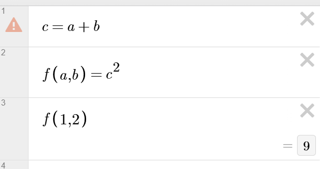

# desmos_formalization

This project aims to formalize a part of desmos's type system and inference.

### goals: 
- model wackscoping
- model inference
- prove soundness/completeness (?)

---

### wackscoping
"wackscope variables" is a term used in the community to refer to variables defined in terms of undefined variables. This seems weird and useless at first, but they can be used in scopes where said variables are defined, so functions expressions like this become valid: 

And indeed, they are frequently used as if they were local function variables. this makes programming much more ergonomic, in a language that has no concept* of local variables. For a more detailed explanation: https://radian628.com/unofficial-desmos-wiki/misc/wackscope/

\* sum indices technically are